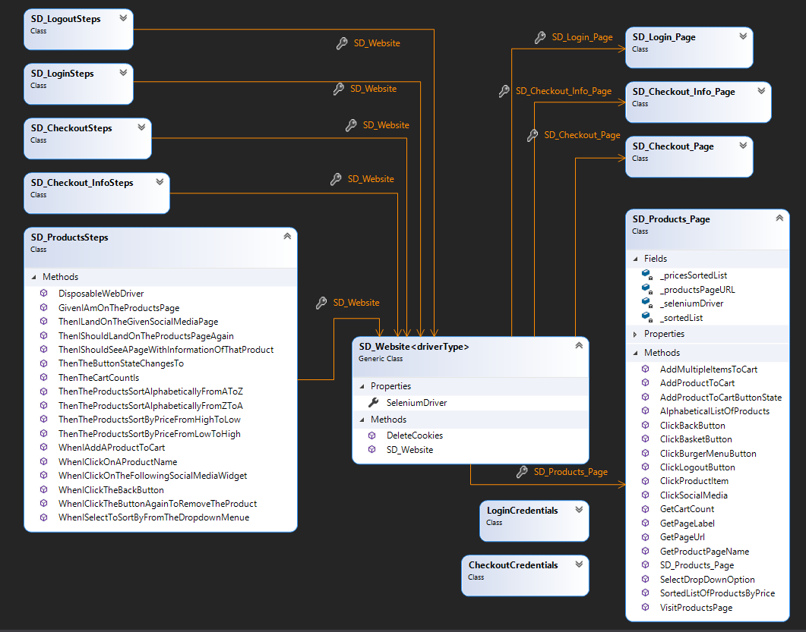

# Sauce Demo Web Testing

##### Table of Contents
1. [Introduction](#Introduction)

2. [Project Goal](#Project-Goal)

3. [Testing Framework Structure](#Testing-Framework-Structure)

4. [BDD Tests](#BDD-Tests)

5. [Test Cases](#Test-Cases)

6. [Discovered Issues with the Sauce Demo](#Discovered-Issues-with-the-Sauce-Demo)

7. [Sprint Review](#Sprint-Review)

8. [Sprint Retrospective](#Sprint-Retrospective)

## Introduction
The purpose of this project is to make a web testing framework for the Swag Labs Sauce Demo website. The website under test can be found [here](https://www.saucedemo.com/).

## Project Goal

Deliver a test framework for the Sauce Demo website.

Write a detailed README.md file that explains how to use the framework.

## Testing Framework Structure
The testing framework takes a BDD approach which makes use of Selenium, Specflow and Gherkin (given/when/then) syntax.

Selenium is a nuget package which enables automation of a browser. For example, a chrome driver can be used to automate a chrome browser by finding web elements and interacting with them through actions such as clicking and typing.

Specflow is a nuget package which allows a tester to enter Gherkin syntax and convert it into a human readable scenario. These scenarios have associated code steps which allow testing of the software.

The class diagram of the framework is shown below:

The SD_Website class is the class which is instantiated to represent the website as a whole. This then has instances of each page object as a property which allows for easy use of each page. 
For example, the SD_Login_Page class has methods which automate entering the username/password and clicking the login button.
The website object and each page has an instance of a driver (chrome/firefox, etc) injected into the constructor so they all use the same instance of the driver.
This driver is used to perform the actions associated with the page's methods on a browser. 

To add additional tests to this framework, use instances of these classes and methods to interact with the driver.

## BDD Tests

Each feature of the website has multiple scenarios written in Gherkin syntax which are broken down into a Given/When/Then statement.
For example:

**Given** I am on the products page

**When** I click on a product name

**Then** I should see a page with information of that product

These feature steps are then converted into snippets of code using the methods from the page objects like so:

## Test Cases

The tests which were carried out are as follows:

 - [User Story 1: Login](https://github.com/sarkerJ/SauceDemoWebTesting/projects/1#card-54647923)
   - [Test Case 1.1](https://github.com/sarkerJ/SauceDemoWebTesting/projects/1#card-54652849)
   - [Test Case 1.2](https://github.com/sarkerJ/SauceDemoWebTesting/projects/1#card-54652943)
   - [Test Case 1.3](https://github.com/sarkerJ/SauceDemoWebTesting/projects/1#card-54654090)
   - [Test Case 1.4](https://github.com/sarkerJ/SauceDemoWebTesting/projects/1#card-54654243)
   - [Test Case 1.5](https://github.com/sarkerJ/SauceDemoWebTesting/projects/1#card-54653008)
   - [Test Case 1.6](https://github.com/sarkerJ/SauceDemoWebTesting/projects/1#card-54653034)
   - [Test Case 1.7](https://github.com/sarkerJ/SauceDemoWebTesting/projects/1#card-54713547)
   - [Test Case 1.8](https://github.com/sarkerJ/SauceDemoWebTesting/projects/1#card-54715481)
 - [User Story 2: Inventory](https://github.com/sarkerJ/SauceDemoWebTesting/projects/1#card-54648203)
   - [Test Case 2.1](https://github.com/sarkerJ/SauceDemoWebTesting/projects/1#card-54702730)
   - [Test Case 2.2](https://github.com/sarkerJ/SauceDemoWebTesting/projects/1#card-54704191)
 - [User Story 3: Product](https://github.com/sarkerJ/SauceDemoWebTesting/projects/1#card-54649106)
   - [Test Case 3.1](https://github.com/sarkerJ/SauceDemoWebTesting/projects/1#card-54702817)
   - [Test Case 3.2](https://github.com/sarkerJ/SauceDemoWebTesting/projects/1#card-54702866)
 - [User Story 4: Basket](https://github.com/sarkerJ/SauceDemoWebTesting/projects/1#card-54648685)
   - [Test Case 4.1](https://github.com/sarkerJ/SauceDemoWebTesting/projects/1#card-54702949)
   - [Test Case 4.2](https://github.com/sarkerJ/SauceDemoWebTesting/projects/1#card-54702988)
 - [User Story 5: Checkout](https://github.com/sarkerJ/SauceDemoWebTesting/projects/1#card-54648711)
   - [Test Case 5.1](https://github.com/sarkerJ/SauceDemoWebTesting/projects/1#card-54703054)
   - [Test Case 5.2](https://github.com/sarkerJ/SauceDemoWebTesting/projects/1#card-54703120)
   - [Test Case 5.3](https://github.com/sarkerJ/SauceDemoWebTesting/projects/1#card-54703155)
 - [User Story 6: Checkout - Your Info Page](https://github.com/sarkerJ/SauceDemoWebTesting/projects/1#card-54789023)
   - [Test Case 6.1](https://github.com/sarkerJ/SauceDemoWebTesting/projects/1#card-54789198)
   - [Test Case 6.2](https://github.com/sarkerJ/SauceDemoWebTesting/projects/1#card-54789241)
   - [Test Case 6.3](https://github.com/sarkerJ/SauceDemoWebTesting/projects/1#card-54789323)
 - [User Story 7: Checkout - Overview](https://github.com/sarkerJ/SauceDemoWebTesting/projects/1#card-54789629)
   - [Test Case 7.1](https://github.com/sarkerJ/SauceDemoWebTesting/projects/1#card-54790662)
   - [Test Case 7.2](https://github.com/sarkerJ/SauceDemoWebTesting/projects/1#card-54790707)
 - [User Story 8: Logging Out](https://github.com/sarkerJ/SauceDemoWebTesting/projects/1#card-54650282)
   - [Test Case 8.1](https://github.com/sarkerJ/SauceDemoWebTesting/projects/1#card-54737968)

## Discovered Issues with the Sauce Demo

- Products page

   - The social media widgets don't link to their respective social media pages

- Checkout page

  - If you click "Checkout", with nothing in the basket, you are still allowed to checkout

- Logging out and logging in

    - The quantity is stored for all users and is not unique to the individual logged in
    - Going to the inventory url skips signing in

- Resetting the app state
  
   - If you click "Reset App State", it doesn't reset the "Add To Cart/Remove" Button
   - The dropdown filter also doesn't reset
   - If you are in your basket and reset, the item remains in the basket, but the basket count remains
   - It also doesn't revert to the Products landing page

## Sprint Review

At the beginning of the sprint, the team planned out the project which included writing user stories to cover each feature and the Gherkin syntax for each scenario/test case.
Throughout the project, the team split these user stories between themselves and gradually completed them. By the end of the project, all user stories bar one had been completed with all of them meeting their definition of done.
The only incomplete user story was the checkout-overview page. This is the user story for confirming the user can view product information before completing check out.

One possible area for improvement would be to produce tests for the state of the basket after logging out. It should be verified that the state is saved for individual users.

## Sprint Retrospective

Overall, the sprint was a success. The team worked together cohesively with an emphasis on collaboration and communication.
Regular pushing of code to the Github repository whilst updating each other on changes contributed towards this success and made for a smoothly running project.
The use of version control assisted in cutting down on risk during the process as it meant changes could be safely implemented without the risk of losing large chunks of work.
Using and regularly updating the project board meant that all team members were kept informed about the current state of the project and could easily track what had been done and therefore what they must do. 